# 키움 자동매매 시스템 업무 흐름도

이 문서는 현재 프로그램이 실시간 데이터를 받아 분석하고, 매수/매도를 실행하는 전체적인 업무 흐름을 시퀀스 다이어그램으로 설명합니다.

## 핵심 데이터 파이프라인 및 매매 시퀀스

```mermaid
sequenceDiagram
    autonumber
    
    actor Market as 키움증권 서버
    participant MW as MainWindow (UI)
    participant Store as SnapshotStore
    participant Scan as SmartScanner
    participant Worker as ScannerWorker
    participant Order as OrderManager

    %% 실시간 데이터 수신
    rect rgb(30, 30, 40)
        note right of Market: 1. 실시간 시세 수신
        Market-->>MW: OnReceiveRealData (현재가, 거래량 등)
        MW->>Store: update_price(code, price, volume, ...)
        note over Store: 1분봉 누적 / 체결가속도 갱신
    end

    %% 스캐너 감시 루틴 (주기적)
    rect rgb(30, 40, 30)
        note right of Market: 2. 스캐너 종목 발굴 루틴
        MW->>Scan: run_periodic_scan()
        Scan->>Store: prefilter_candidates() (거래량/상승 중인 종목 필터)
        Store-->>Scan: 유효 종목 리스트
        
        Scan->>Worker: _evaluate(snapshot) (종목별 평가)
        
        alt 돌파(BREAKOUT) 발생 시
            Worker->>Worker: _breakout_pending 에 대기 등록
        end
        
        alt 대기 중인 종목 평가
            Worker->>Worker: Fast-Track 조건 확인 (OPENING 슬롯 20초 / 수급 점수 0초)
            Worker->>Worker: 이평선 정배열, 거래량 급증, 체결강도 확인 (check_jdm_entry)
        end
        
        Worker-->>MW: on_signal (매수 신호 발생!)
    end

    %% 매수 주문 실행
    rect rgb(40, 30, 30)
        note right of Market: 3. 신호 수신 및 매수
        MW->>MW: 최대 보유 종목 수 / 일일 손익 한도 락 체크
        MW->>Order: handle_signal(signal)
        Order->>Market: 시장가 매수 주문 전송 (SendOrder)
        Market-->>Order: 체결 통보 (OnReceiveChejanData)
        Order->>Order: positions 에 종목 추가 및 평단가 기록
    end

    %% 포지션 관리 및 매도
    rect rgb(40, 40, 30)
        note right of Market: 4. 실시간 포지션 관리 (1분 주기 / 실시간 갱신)
        MW->>MW: _auto_sell_by_pnl() 실행 (보유 종목 스캔)
        MW->>Order: positions 수익률 검사
        
        alt 손절 또는 트레일링 스탑 가격 도달 시
            MW->>Store: 1분봉 EMA20 계산 요청 (Trend Protect)
            
            alt EMA20 지지 중
                MW->>MW: "🛡️ 눌림목 보류 - 청산 보류" 로깅
            else EMA20 이탈 또는 Hard Stop(-2.0%)
                MW->>Order: 전량 청산 지시
                Order->>Market: 시장가 매도 주문 전송 (SendOrder)
            end
        else Time-cut 도달 (ex: 25분 이상 횡보)
            MW->>Order: 시간 초과 청산 지시
            Order->>Market: 시장가 매도 주문 전송
        end
    end
```

### 각 컴포넌트의 역할
1. **MainWindow:** 시스템의 심장부로 UI 이벤트 루프와 타이머(1분 주기 포지션 검사 등)를 구동하며, 키움 Open API와의 통신 채널을 담당합니다.
2. **SnapshotStore:** 수십 개의 감시 종목들의 1분봉 데이터와 수급 데이터를 메모리(Pandas DataFrame)에 캐싱하여 빠른 연산을 가능하게 합니다.
3. **SmartScanner / ScannerWorker:** 사전에 정의된 `BUY_CRITERIA` (예: JDM 전략, 수급 가중치, 체결강도)를 바탕으로 매 초 단위로 종목들을 필터링하고 타점을 잡습니다.
4. **OrderManager:** 보유 중인 포지션(평단가, 고점 Peak Price)을 관리하고, 트레일링 스탑, 익절, 손절 퍼센티지를 추적하여 매수/매도 주문을 API로 전송합니다.
